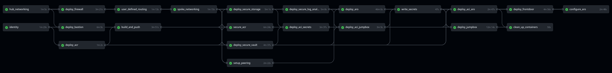
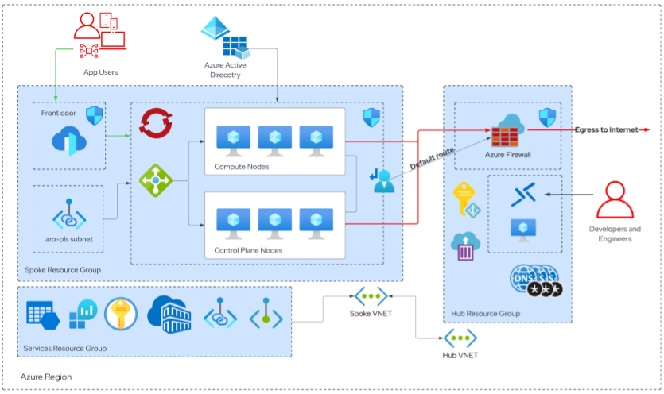
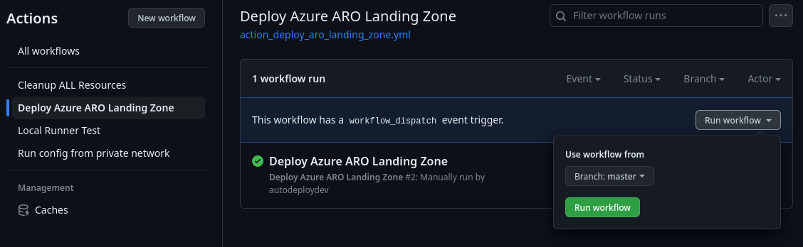

# Azure Red Hat OpenShift (ARO) Landing Zone Automated Deployment

Deploying Azure Red Hat OpenShift (ARO) is a fairly straightforward process, by following the [official documentation](https://docs.microsoft.com/en-au/azure/openshift/intro-openshift), creating the required Azure networking infrastructure, and running the deployment command, a highly available OpenShift cluster will become available and ready to run containerised workloads in approximately 30-40 minutes.

But ARO is just one piece of the secure workload and cloud puzzle. How does ARO integrate with an organisation's existing Azure environment, especially infrastructure that has been architected and deployed with security in mind?

This repo aims to provide insight into this question. Using a Github actions workflow this repo will deploy a functioning [Azure Red Hat OpenShift Landing Zone](https://learn.microsoft.com/en-us/azure/cloud-adoption-framework/scenarios/app-platform/azure-red-hat-openshift/landing-zone-accelerator), and configure ARO with some essential day 2 Azure integrations.



ARO is a first party service on Azure which means that it's part of the Azure API, as such I have purposely created this repo using tooling that is familiar to Azure customers to prove that ARO can be integrated into Azure environments the same way that they can deploy their other Azure resources. It is designed to take customers from nothing to an private environment with ARO as the destination for containerised workloads. Supporting this environment are all the recommended secure Azure resources including managed identities, keyvault, and private endpoints.

# High Level Architecture
Let's start by looking at the High level architecture. Aligning with Azure's landing zone implementation the deployment creates three resource groups;



* A Network Hub resource group 
  * Contains resources to provide secure access into the private network such as Azure firewall and a Bastion for a Jumpbox virtual machine. This hub is capable of servicing multiple spoke resource groups and therefore multiple ARO clusters.
* A Spoke resource group
  * Contains Azure Red Hat OpenShift (ARO) and an Azure Front Door load balancer which will expose an application on ARO to the internet.
* A Services resource group
  * This resource group logically separates essential Azure resources used in the secure deployment and can be re-used for applications running on ARO. Resources such as keyvault, storage and log analytics workspace. Access to these resources is provided to the ARO and the private network via Azure private endpoints.

# Resource Details
[Click Here](./docs/resource_details.md) for a description of the Azure Red Hat OpenShift Landing Zone Resources.

# Workflow Job Details
[Click Here](./docs/workflow_details.md) for a description of the Azure Red Hat OpenShift Landing Zone deployment Github actions workflow jobs.

# General Deployment Workflow
Configuring resources which are restricted to private networks can be quite problematic using public tooling such as Github actions as there is no direct connectivity. The solution to this problem was to initially use bicep to deploy the [container registry](./docs/resource_details.md#container-registry) as a public resource, build a [container](./docs/workflow_details.md#container) from the provided Dockerfile and then run bicep over the container registry again but this time modifying it so that it was locked down to private network access using a private endpoint only.

* Copy this repo to a private repo of your own
* Create a Github personal access token
* Create an Azure Service principal 
* Create 3 resource groups and grant the Azure Service Principal `Contributor` and `User Access Administration` permissions scoped to these resource groups.
* Create Github repository secrets and variables (use the helper script to make it easy)
* [Run the Github actions workflow](./docs/workflow_details.md)
* Log into Azure Red Hat OpenShift using your Azure Active Directory account

# Pre-requisites

## Make a copy of this repo on Github
Make a copy of this repo to your Github account, ensure that it is a private repo, this wil prevent accidental leaking of secrets and avoid anyone from the public running the Github actions workflow.

> **Warning** 
> Please be careful about how you store secrets. It is advised to use a private repo to ensure that there is a less chance of private data exposure.

## Create a Github Personal Access Token
1. The Github Personal access token is injected as a secure environment variable into the Github runner container which is used in the workflow so that it can register itself to your Github repository as a runner and poll for jobs.

2. (Optional) The Github Personal access token can also be used to authenticate to Github using the Github cli so that you run the `gh_secrets_create.sh` helper script to write [secrets and variables](#Github-secrets) to your private Github repository.

* Create a personal access token
  * Github > User Settings > Developer Settings > Personal access tokens (or https://Github.com/settings/tokens)
  * Set an expiry and add a note 'used for ARO deployment'
  * Grant permissions for "repo", "workflow", "admin:org", "admin:public_key"
  * Save the token
  * Run the following command `gh auth login` and paste in the token
  * Github.com, SSH, \<Select SSH Key\>, Paste an authentication token
  * Insert the PAT as a Github secret as per the "secrets" table below "PAT_Github" (or use the `gh_secrets_create.sh` helper script)

## Create a Service Principal
For this repo an Azure service principal is required. It has 3 uses;

1. *Deploying ARO* - A resource principal is needed to provide secure access to Azure resources that are required to deploy and manage an ARO cluster. A resource principal is essentially an identity for your ARO cluster that allows it to access and manage Azure resources such as virtual networks, storage accounts, and other resources required by the cluster. By creating a resource principal, you can grant your ARO cluster the necessary permissions to access and manage Azure resources without giving it full access to your entire Azure subscription.

2. *Deploy Resources to Azure using Github actions* - The Azure service principal is used by Github Actions to authenticate and authorize the deployment of your code to Azure resources. This allows Github Actions to perform actions such as creating or updating resources, deploying code to virtual machines, and more. The permissions that are granted to the service principal are `Contributor` and `User access admin` scoped to the three resource groups that are created.
- `Contributor` permits resource creation
- `User access admin` permits adding the Azure Red Hat OpenShift Resource Provider the appropriate permissions during the Azure installation.

3. *Credentials for ARO to use AAD as identity provider* - During the configuration of the OpenShift identity provider the Azure service principal is used 

### Create the Azure Service Principal

```
$ export SP_NAME="<insert name for the service principal here>"

$ az ad sp create-for-rbac -n $SP_NAME --role contributor --sdk-auth --scopes "/subscriptions/$SUBSCRIPTION/resourceGroups/$SPOKE_RG" > sp.txt

$ export AAD_CLIENT_ID=$(az ad sp list --all --query "[?displayName == '$SP_NAME'].appId" -o tsv)

```

### Scope the Service Principal's permissions to the hub and spoke resource groups

> **Note**
> Alternatively please use the `lz_rg_create.sh` helper script to automate these commands

```
$ export SCOPE_HUB=$(az group create -n $HUB_RG -l $LOCATION --query id -o tsv)
$ export SCOPE_SPOKE=$(az group create -n $SPOKE_RG -l $LOCATION --query id -o tsv)


$ az role assignment create --assignee $AAD_CLIENT_ID --role contributor --scope $SCOPE_HUB
$ az role assignment create --assignee $AAD_CLIENT_ID --role contributor --scope $SCOPE_SPOKE
$ az role assignment create --assignee $AAD_CLIENT_ID --role "User Access Administrator" --scope $SCOPE_SPOKE

```

## Create Red Hat pull secret 
For an Azure Red Hat OpenShift (ARO) private cluster deployment, a Red Hat pull secret is still needed to download and use Red Hat images for Operators found in the Operator Hub. A pull secret is essentially an authentication token that provides access to Red Hat's registry, which contains container images and other software packages. If you do not have a pull-secret from Red Hat already then please browse to [cloud.redhat.com](https://cloud.redhat.com) to create one. The Red Hat pull secret will be used as a Github repository secret.

Place the Red Hat pull secret in a file called `pull-secret.json` at the root of this repo to ensure that the helper scripts can read it and write it to Github repository secrets for use in the Github actions workflow.

## Set Parameters and Variables for your environment

1. Modify the parameters found in `./action_params/*.json` to suit your Azure environment.

## Create Active Directory Security Group
Create an Activer Directory Security Group which will contain the users that will be administrators for Azure Red Hat OpenShift (ARO).

## Run the helper scripts

### Set Helper Script Variables
Set the following variables in the file `helper_vars.sh` to ensure that the helper scripts can operate

| Helper Var Name | Description |
| --- | --- | 
| SP_FILE | File name which stores the service principal credentials. It should be `sp.txt` if you followed the commands above | 
| SP_NAME | Name of the service principal that you created above | 
| GH_REPOSITORY | The private github repository you are running this code from. In `github-owner/repository` format |
| PAT_GITHUB | The Personal Access Token for Github that you created above |
| LOCATION | Azure Region where cloud resources will be deployed | 
| HUB_RG | The name of the resource group which will store Network Hub services such as Azure Firewall |
| SPOKE_RG | The name of the resource group which will store Azure Red Hat OpenShift (ARO) components |
| SERVICES_RG | The name of the resource group which will store services such as keyvault and ACR |
| AAD_ADMIN_GROUP_ID | The ID of the Azure Active Directory Security Group. Get ID by running the following command `az ad group show -g <AAD GROUP NAME> --query id -o tsv` | 
| GH_RUNNER_VERSION | The latest github runner version from https://github.com/actions/runner/releases/ |
| HELM_VERSION | The latest helm version from https://github.com/helm/helm/releases |
| JUMPBOX_ADMIN_USER | The name of the Jumpbox Virtual Machine Admin User | 
| JUMPBOX_ADMIN_PWD | The password for the Jumpbox Virtual Machine Admin User | 
| CONTAINER_BUILD_NAME | The name and tag for the Github runner container that is build default `aro-github-runner:1` | 

All other variables in this file will be determined via lookup commands.

### <a id="Github-secrets"></a>Create the Github Repository Secrets and Variables

> :warning: Remember to log in to the `gh` cli tool prior to the `gh_secrets_create.sh` helper script.

Github repository secrets are encrypted environment variables that you can store in a repository on Github. These secrets are used to store sensitive information that is required by your Github Actions workflows, such as API keys, access tokens, and other secrets. Github Actions repository variables are environment variables that you can define for a specific repository in Github. These variables can be used in Github Actions workflows to store values that are specific to that repository.

Ensure that you are logged in to the Azure CLI with a user that has appropriate permissions and execute the script;

`./gh_secrets_create.sh`

### Run Resource Group creation
Prior to running the workflow a user with the appropriate permissions must create the initial resource groups and scope the service principal permissions to them.

Run `./lz_rg_create.sh` to perform these actions for you. You will need to change the variables at the top of the file to suit your environment.

## Github actions Azure Red Hat OpenShift Landing Zone

To run the Github actions to deploy the environment select the following;



## Github actions Resource Cleanup

To complete a full cleanup of Azure resources execute the delete helper script `./lz_rg_delete.sh` which will run resource group delete commands for you. You will need to change the variables at the top of the file to suit your environment.

An azure keyvault stays in a deleted state for approximately 90 days after deletion. This script will also purge the keyvault to ensure that there are no failures on the next ARO deployment.

# **Pull Requests are welcome!**