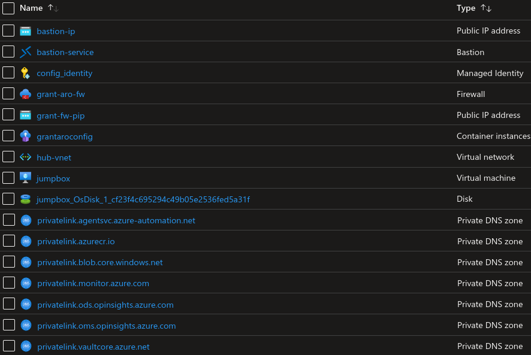
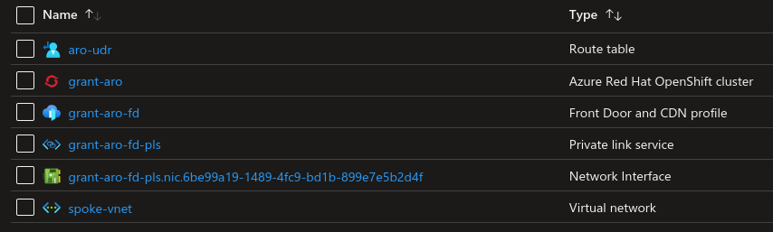
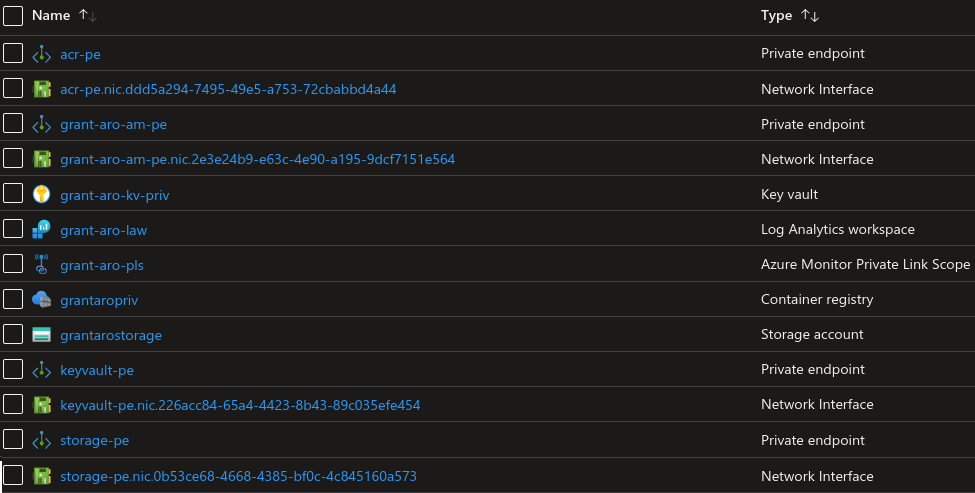

##  Hub Resource Group

### Virtual Network
The hub vnet contains all the subnets for the hub services. This includes firwall, bastion service, and container registries. This hub network is peered with the spoke's virtual network. By default, Azure virtual networks provide Internet connectivity which allows resources in the hub to talk out. This is intended and helps with the deployment and configuration workflow.

### Bastion and Jumpbox
The bastion is created to provide secure HTML 5 RDP session to the Windows 11 Jumpbox. The jumpbox contains common tools such as browsers, the Azure cli, the OpenShift cli, and helm to help gain access to the cloud and interact with ARO. The jumpbox is configured using a custom script extension called "openshift.ps1" which is stored in the [storage account](#storage-account) in the [services resource group](#services-rg).

###  Managed Identity
A managed identity is created so that resources like the Jumpbox and Azure container instances (Github runner) have RBAC access to the keyvault and storageaccount in order to retrieve secrets and configuration files essential to the landing zone deployment.

### Azure Firewall
The firewall will be used to protect inbound and outbound traffic of the private ARO cluster. Traffic from the ARO cluster is routed to the firewall as the first hop using User Defined Routes (UDR) on the ARO subnets. Firewall rules will need to be configured to allow pulling containers from external image repositories. In this deployment I have created rules for common repositories, however, these can be changed in the code prior to deployment. 

### Private DNS Zones
The hub also holds all the private dns zones that are needed to support the private endpoints for the various services. Each private DNS zone consists of virtual network links to the Hub and Spoke virtual networks.

###  Azure Container Instances (Github Runner)
During the pipeline execution, when the need to configure resources from the private network arises a container instance is deployed using an [image](./workflow_details.md#container) that was built and pushed to a Azure container registry in the [services](#services-rg) resource group. This will start a github runner on the private network which will poll the github repo for jobs to execute. The container instances are associated with the [managed identity](#managed-identity) which, using RBAC will permit access to secrets in the [keyvault](#keyvault) and configuration files in the [storage account](#storage-account).

##  Spoke Resource Group

### Virtual Network
ARO requires two subnets created in a virtual network. These subnets host the OpenShift control plane and compute nodes. For this landing zone deployment this vnet is peered to the vnet in the hub and has [user defined routes](#udr).

###  User Defined Routes
All traffic in and out of the ARO control plane and compute subnets is routed through the [firewall](#azure-firewall). New ARO clusters (4.6+) now deploy with a feature called "egress lockdown" which allows the cluster to scale as expected even traffic is blocked from direct access to the Internet. OpenShift core containers and Red Hat Core OS (RHCOS) images are now pulled from the service's resources using a path via the deployed private link

### Azure Red Hat OpenShift (ARO)

The Azure Red Hat OpenShift (ARO) resource is created in the [spoke resource group](#spoke-rg). The typical cloud resources that make up the OpenShift cluster (virtual machines, loadbalancers etc) are deployed to a separate resource group which is restricted by a deny assignment. This means you can view the resources that make up the cluster however the majority of resource customisations that you would perform via the Azure API have been blocked. This is designed to ensure that SRE can keep a baseline to ensure that they can maintain the SLA uptime of 99.95%. Any modifications to cloud resources will need to be made via the OpenShift API once ARO has provisioned.

#### *Azure Active Directory Identity Provider*

As a Day 2 integration the ARO cluster is configured with [Azure Active directory](../README.md#aad-oauth) as the Identity provider. Users of ARO will log into the cluster using their Azure Active directory credentials. By using Azure Active Directory, group claims can be extended into the OpenShift cluster and used for RBAC.

#### *Deployed Operators from OpenShift OperatorHub*
* (Optional) Web terminal
  * The web terminal operator provides a terminal session for OpenShift in the browser. You will be able to interact with the OpenShift cluster using the openshift cli tool 'oc'.

* Operators to enable log forwarding to Azure Log Analytics workspaces
  * The elasticsearch, openshift logging and loki operators are deployed to provide the tools to enable log forwarding to the [log analytics workspace](#law)

#### *Sample web application*
A sample web application is deployed to demonstrate using [Azure front door](#afd) to expose an application on a private network to the Internet.

###  Azure Front Door

An Azure front door is deployed to act as a secure front end when exposing the sample web application to the Internet.

##  Services Resource Group

###  Storage Account
The storage account is deployed and secured with access permitted via the private link service. The storage account stores files that will be used for configuration of cloud resources on the private network. Files are accessed by the [GitHub Runner container](./workflow_details.md#container) and the jumpbox. The [managed identity](#managed-identity) is used to gain access to the storage account and download the configuration files.

1. `openshift.ps1` is used by the jumpbox as a custom script extension to configure itself.
1. `openshift_config.tar.gz` packages the yaml files in the `openshift_configuration` folder of this repo. These files are used by the [azure container instance](#aci) to configure ARO from the private network

###  Keyvault
A keyvault is created which will store the secrets required by the deployment on the internal network. These include secrets such as the ARO kubeadmin password and the API endpoint. Again, the [azure container instance](#aci) will use the [managed identity](#managed-identity) to gain access to these secrets.

###  Azure container Registry
The container registry holds the [GitHub Runner container](./workflow_details.md#container) that is used when an [Azure container instance](#aci) is deployed to configure resources from the private network.

###  Log Analytics Workspace
The log analytics workspace serves as the Azure destination for OpenShift logs. Infrastructre, Application and Audit logs are forwarded via the private link servie to the log analytics workspace.

### Azure Monitor Private Link Scope
The private link scope connects to the [log analytics workspace](#law) permitting traffic to be sent to it using the private endpoint

### Private Endpoints and Network Interface Cards (NIC)
All services deployed to the services resource group are configured for access via the private endpoint and private link ervices only. This creates azure private endpoint resources as well as the associated network interface cards.