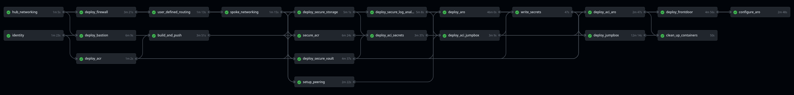

## hub_networking
Creates the virtual network for the hub resource group. The following subnets are created;

* Subnet for Azure Firewall
* Subnet for Bastion Service
* Subnet for Jumpbox 
* Subnet for Container Instances (delegated to containerGroups)

Outputs the resource names for future use in the workflow.
    
## identity

Creates a user defined managed identity used for credentialess access to private resources and other Role Based Access Control (RBAC).

Outputs the resource name, clientId and principalId for future use in the workflow.

## deploy_firewall

Deploys the Azure firewall with its public IP. The firewall inspects network traffic in and out of the spoke resource group. Firewall rules are defined in this step.

Outputs the firewall's private IP for future use in the workflow.

## deploy_bastion

Deploys the Azure Bastion Service which enables you to connect to the Jumpbox via an HTML5 VPN.

## deploy_acr

This job deploys a publicly accessible container registry which will be the destination for the Github runner container build. The ACR is locked down at a later step in the workflow.

Outputs the login server address, the name of the container registry and the SKU name for future use in the workflow.

## build_and_push

Uses Docker to build the push the container to the Azure container Registry via the publicly accessible endpoint.

###  Github Runner Container
The Dockerfile builds the [GitHub Runner container](#container). This container is built on top of the Red Hat Universal Base Image (UBI) and includes relevant tooling such as the azure cli, the openshift cli, the github runner code and other linux tools. When started the container runs the `runner_entrypoint.sh` script which starts the GitHub runner polling service. 

## user_defined_routing

The route table is created for the control plane and compute subnets in the spoke resource group. The UDR will force tunnel traffic to the Azure Firewall in the hub resource group.

Outputs the route table name.

## spoke_networking

Creates the virtual network for the spoke resource group. The following subnets are created and configured for Azure Red Hat OpenShift;

* control plane subnet - disabled private link service policies, adds a service endpoint for Azure Container Registry
* compute subnet - disabled private link service and endpoint policies, adds a service endpoint for Azure Container Registry

The route table from the previous job is also attached to both these subnets to force tunnel traffic to the firewall.

Outputs the virtual network name and the compute subnet name for future use in the workflow.

## deploy_secure_storage

Deploys the private DNS zone `privatelink.blob.core.windows.net` used for the storage account's private link, links this to spoke and hub virtual networks.

Deploys the storage account, assigns RBAC permissions for the managed identity and configures the private link.

Outputs the blob endpoint, blob container name, and storage account name for future use in the workflow.

## secure_acr

This job runs the second pass against the Azure Container Registry in order to secure it for access only via the private network. 

It deploys the private DNS zone `privatelink.azurecr.io` used for the container registy's private link, links this to the spoke and hub virtual networks.

Secures the ACR by removing access to public endpoints and restricting access to the private network. Permits managed identity access.

Outputs private DNS zone name for future use in the workflow.

## deploy_secure_vault

Deploys the private DNS zone `privatelink.vaultcore.azure.net` used for the Keyvault's private link, links this to spoke and hub virtual networks.

Deploys a Keyvault only accessible on the private network. Permits managed idnetity access.

Ouputs private DNS zone name, URI for the Keyvault and the Keyvault name for future use in the workflow.

## setup_peering

Creates the peering between the Hub and Spoke Virtual Networks

## deploy_secure_log_analytics_workspace

Deploys the private DNS zones `privatelink.agentsvc.azure-automation.net`, `privatelink.monitor.azure.com`, `privatelink.ods.opsinsights.azure.com`, `privatelink.oms.opsinsights.azure.com` used for sending logs to log Analytics workspaces via the private network and links these to the spoke and hub virtual networks.

Deploys the log analytics workspace and the private link service to enable logs to be ingested by Log analytics workspaces on the private network.

Outputs private DNS zone names, Log Analytics workspace name for future use in the workflow.

## deploy_aci_secrets

Deploys a private github runner container as an Azure container instance. This will poll the Github repository for jobs from the Githubs actions workflow. This runner will later execute the `write_secrets` job in the workflow as this configuration needs to occur on the private network which this container has access.

Passes the github repository name and github personal access token to the container as seucre environment variables to permit the container to register to the repository as a runner. 

Once job has been completed the container is stopped and no longer listens to Github for workflow jobs.

## deploy_aro

Deploys the latest version available for Azure Red Hat OpenShift (ARO) in the designated region.

## deploy_aci_jumpbox

Deploys a private github runner container as an Azure container instance. This will poll the Github repository for jobs from the Githubs actions workflow. This runner will later execute the `deploy_jumpbox` job in the workflow as this configuration needs to occur on the private network which this container has access.

Passes the github repository name and github personal access token to the container as seucre environment variables to permit the container to register to the repository as a runner. 

Once job has been completed the container is stopped and no longer listens to Github for workflow jobs.

## write_secrets

This job writes secrets created during the Github actions workflow to the Azure Keyvault on the private network. This will ensure that secrets will be available to jobs in the workflow which configure resources on the private network. The secrets are later retrieved using the managed identity attached to the container instance.

Additionally the yaml files used to configure OpenShift are packaged up and uploaded to the storage account on the private network, again, to be availabe to jobs in the workflow which configure resources on the private network. The secrets are later retrieved using the managed identity attached to the storage account.

## deploy_aci_aro

Deploys a private github runner container as an Azure container instance. This will poll the Github repository for jobs from the Githubs actions workflow. This runner will later execute the `configure_aro` job in the workflow as this configuration needs to occur on the private network which this container has access.

Passes the github repository name and github personal access token to the container as seucre environment variables to permit the container to register to the repository as a runner. 

Once job has been completed the container is stopped and no longer listens to Github for workflow jobs.

## deploy_jumpbox

Creates a Windows 11 virtual machine on the private network. This job runs on a private runner because a custom script extension stored in the private storage account (`openshift.ps1`) will need to be retrieved in order for the virtual machine to configure itself.

The powershell script installs tooling required for access to Azure and the Azure Red Hat OpenShift (ARO) cluster.

## deploy_frontdoor

This job deploys and configures Azure front door to expose a sample web app deployed on the ARO cluster to be publicly available.

## clean_up_containers

Once the `write_secrets` and `deploy_jumpbox` jobs have completed the Github runner container terminates and is no longer used. This job removes the Azure container instance definition for these two jobs.

## configure_aro

Day 2 configuration of the OpenShift cluster (Identity providers, storage classes, or OpenShift operators) is performed on this step using the github runner. The runner uses a managed identity to get the ARO kubeadmin password and api endpoint from Azure keyvault, downloads the files from the secure storage, and then runs commands against the ARO cluster with kubernetes cluster admin privileges.

Whilst this script works for initial configuration of an ARO private cluster, for subsequent configuration it is recommended to use a kubernetes configuration tool such as Red Hat Advanced Cluster Management (RHACM) or a different Github actions workflow.